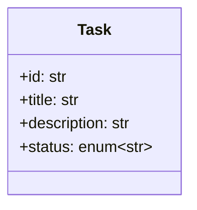

# task-ai

## 概要

これは、タスク管理アプリです。エージェントファースト業務アプリケーションの形を模索するためのプロトタイプとして、イベントソーシング×MCPで実装を行います。デモ目的の簡易的な作りのため、初期実装ではイベントストアはインメモリで実装し、CQRSも実装しません。

## 機能

- [ ] タスクの追加
- [ ] タスクの編集
- [ ] タスク一覧の表示
- [ ] タスク詳細の参照
- [ ] タスクの変更履歴閲覧
- [ ] タスクの状態復元

## 技術スタック

- 言語: Python
- イベントストア: インメモリ

## データモデル

- タスク(task)



- ステータス(status)
  - todo
  - in_progress
  - done

## イベント

- TaskCreated

サンプル
```json
{
  "event_id": "1234567890",
  "task_id": "12345",
  "event_type": "TaskCreated",
  "payload": {
    "title": "タスクのタイトル",
    "description": "タスクの説明",
    "status": "todo"
  }
}
```

- TaskUpdated

サンプル
```json
{
  "event_id": "1234567890",
  "task_id": "12345",
  "event_type": "TaskUpdated",
  "before": {
    "title": "タスクのタイトル",
    "description": "タスクの説明",
    "status": "in_progress"
  },
  "after": {
    "title": "タスクの新しいタイトル",
    "description": "タスクの新しい説明",
    "status": "done"
  }
}
```

## MCPインターフェース

### ツール

#### create_task

##### インプット
```json
{
  "title": "タスクのタイトル",
  "description": "タスクの説明",
}
```

##### アウトプット
```json
{
  "task_id": "12345"
}
```

#### update_task

##### インプット
```json
{
  "task_id": "12345",
  "title": "タスクのタイトル",
  "description": "タスクの説明",
  "status": "in_progress"
}
```
##### アウトプット
```json
{
  "task_id": "12345"
}
```

- list_tasks

##### インプット
```json
{}
```

##### アウトプット

```json
{
  "tasks": [
    {
      "task_id": "12345",
      "title": "タスクのタイトル",
      "description": "タスクの説明",
      "status": "todo"
    },
    {
      "task_id": "67890",
      "title": "タスクのタイトル2",
      "description": "タスクの説明2",
      "status": "in_progress"
    }
  ]
}
```

#### get_task

##### インプット
```json
{
  "task_id": "12345"
}
```

##### アウトプット
```json
{
  "task_id": "12345",
  "title": "タスクのタイトル",
  "description": "タスクの説明",
  "status": "todo",
  "history": [
    {
      "event_id": "1234567890",
      "message": "タスクが作成されました",
    },
    {
      "event_id": "0987654321",
      "message": "タイトルが~から〜に変更されました",
    }
  ]
}
```
